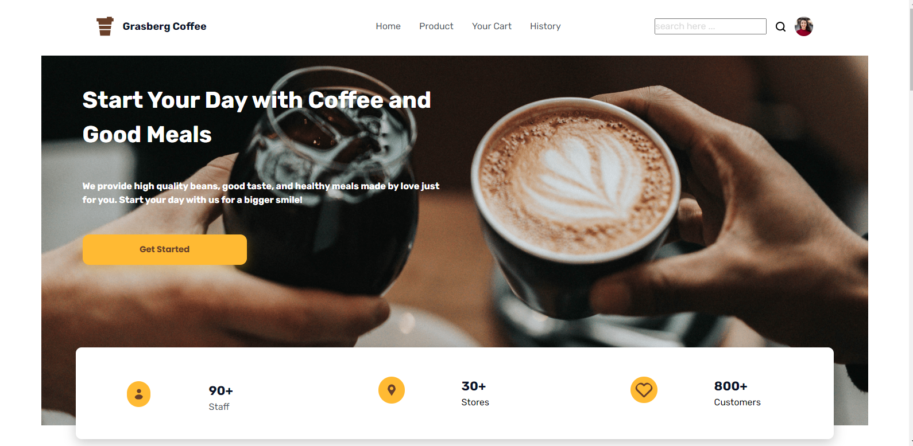
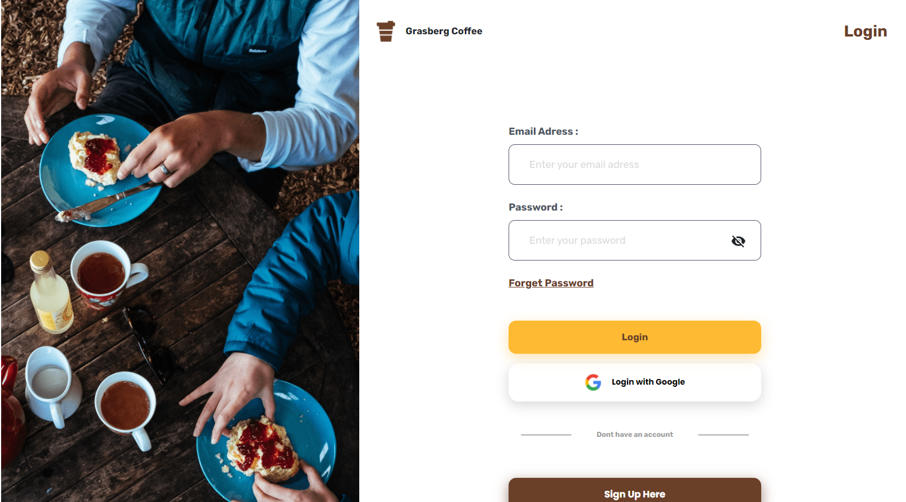
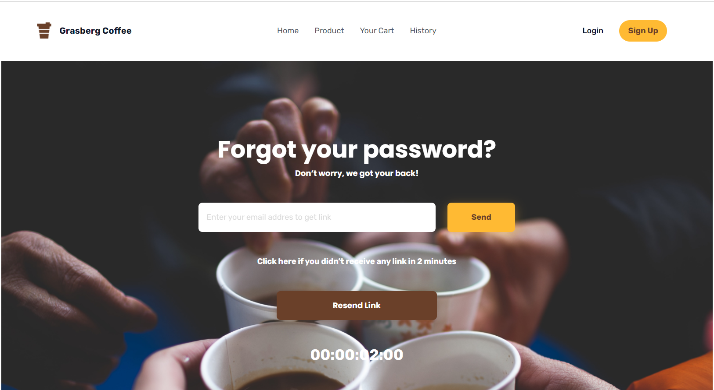
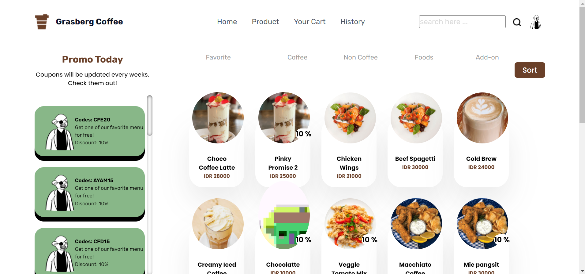

<a id="readme-top"></a>

<br />
<div align="center">

  <h2 align="center">Grasberg Coffee</h2>

  <p align="center">
    <a href="#">View Demo</a>
    ·
    <a href="#">Report Bug</a>
    ·
    <a href="#">Request Feature</a>
  </p>
</div>

## Built With

<p align="center">
  <a href="https://skillicons.dev">
    
  </a>
</p>

<p align="right">(<a href="#readme-top">back to top</a>)</p>

# About The Project

## Contents

- [About The Project](#about-the-project)
  - [Contents](#contents)
  - [Features](#features)
    - [User](#user)
    - [Admin](#admin)
  - [How to Run the Application](#how-to-run-the-application)
    - [1. Clone this repository](#1-clone-this-repository)
    - [2. Install dependency packages](#2-install-dependency-packages)
    - [3. Configure .env file](#3-configure-env-file)
    - [4. Run projects](#4-run-projects)
  - [Contributing](#contributing)
  - [Deployment](#deployment)
  - [Related Projects](#related-projects)
  - [Documentation](#documentation)
  - [Contributors](#contributors)

## Features

### User

- Auth
  - Login
  - Logout
- User
  - Register
  - Forgot Password
  - Reset Password
  - Edit Profile
- Product
  - Search Product
  - FIlter Product
  - Sort Product
- Transaction
  - Create Transaction
  - Get History
  - Delete History

### Admin

- Auth
  - Login
  - Logout
- User
  - Register
  - Forgot Password
  - Edit Profile
- Product
  - Add Product
  - Edit Product
- Transaction

## How to Run the Application

<!-- ## Installation -->

### 1. Clone this repository

Clone this repository by run the following code:

```
$ git clone https://github.com/Rama-z/Grasberg-Coffee-Front-End-Reactjs
```

### 2. Install dependency packages

Install dependency packages by run the following code inside project folder:

```
$ npm install
```

### 3. Configure .env file

Configure .env file by create file named .env inside project folder and add this line to the file:

```
NEXT_PUBLIC_BACKEND_URL = "https://grasberg-coffee-be.vercel.app/"
```

### 4. Run projects

Run this projects by run the following code:

```
$ npm start
```

It runs the app in the development mode.\
Open [local host](http://localhost:3000) to view it in your browser.

The page will reload when you make changes.\
You may also see any lint errors in the console.

<p align="right">(<a href="#readme-top">back to top</a>)</p>

## Contributing

 

1. Fork the Project
2. Create your new Branch ( `git checkout -b ...` )
3. Commit your Changes ( `git commit -m '...'` )
4. Push to the Branch ( `git push origin ...` )
5. Open a Pull Request

<p align="right">(<a href="#readme-top">back to top</a>)</p>

## Deployment

[Vercel Deployment Link](https://grasbergcoffee.vercel.app/)

<p align="right">(<a href="#readme-top">back to top</a>)</p>

## Related Projects

[Grasberg Coffee Backend](https://grasberg-coffee-be.vercel.app/)<br/>
[Grasberg Coffee Mobile](https://bit.ly/3X9XNTV)

<p align="right">(<a href="#readme-top">back to top</a>)</p>

## Documentation






## Contributors

<center>
  <table>
    <tr>
      <td align="center">
        <a href="https://github.com/Rama-z">
          <br/>
          <sub><b>Zanuar Bagus</b></sub>
        </a>
      </td>
    </tr>
  </table>
</center>

<p align="center"> <samp><i>&copy; 2022 Grasberg Coffee</i></samp> </p>
